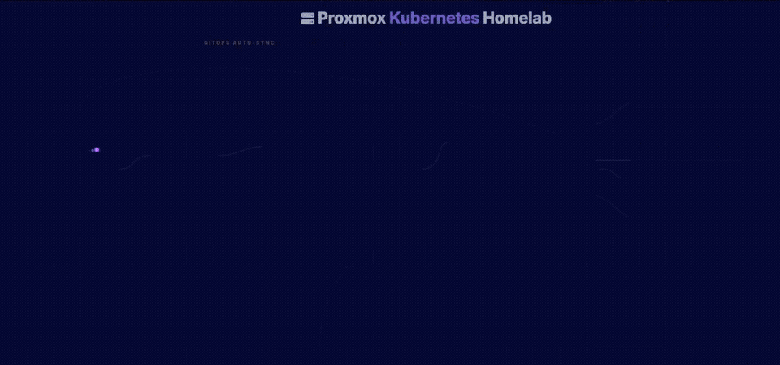
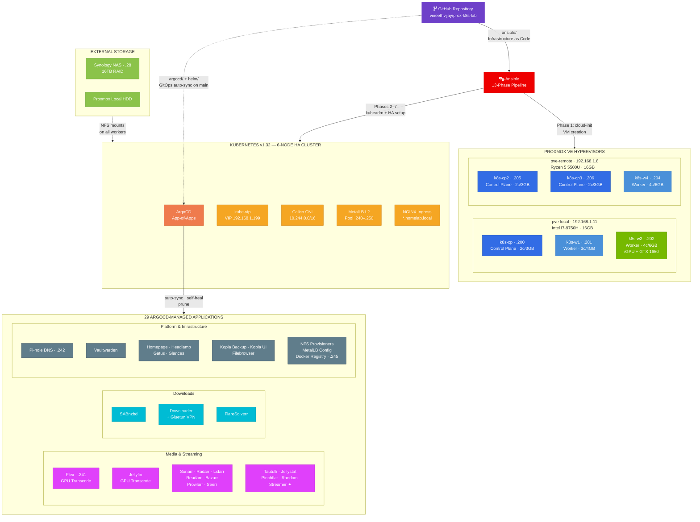
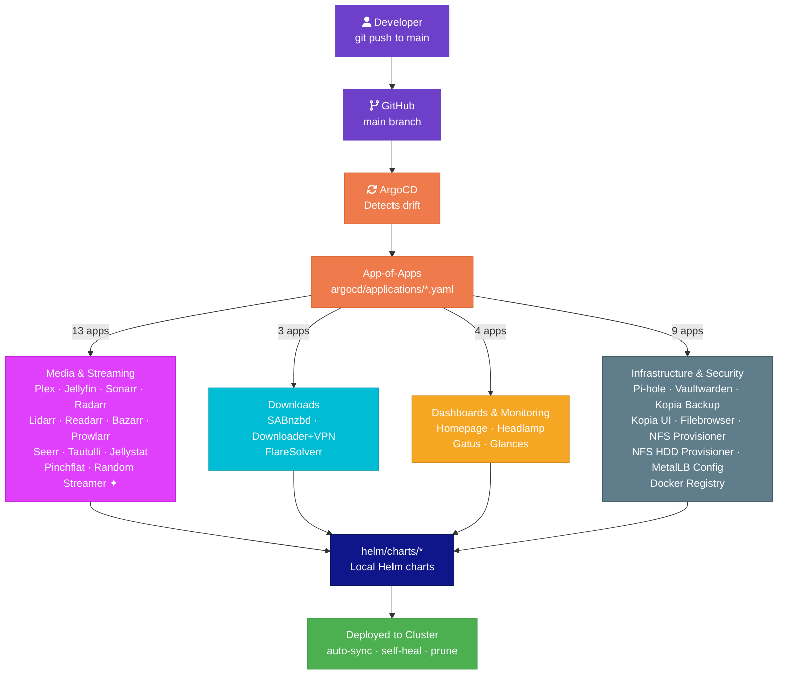
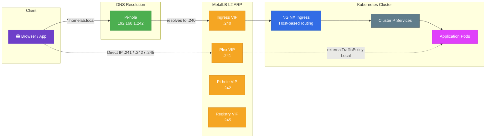

# Proxmox Kubernetes Homelab

A complete, code-driven homelab that takes two bare-metal Proxmox hosts from empty to a fully operational HA Kubernetes cluster running self-hosted services — media streaming, automation, DNS, backups, monitoring, and more.

Ansible provisions the VMs and bootstraps the cluster, kubeadm sets up a highly available control plane, and ArgoCD takes over from there — continuously deploying and self-healing every application via GitOps using local Helm charts. Push to `main`, everything syncs. This repo is the single source of truth.

> **Disclaimer:** This project is for **homelab learning and educational purposes** only. I do not support or encourage piracy. The media automation tools included here are meant to be used with legally obtained content.

## How It All Works

This project automates a complete Kubernetes homelab from bare metal to running services. The pipeline flows through four stages: **Ansible provisions VMs on Proxmox**, **kubeadm bootstraps an HA K8s cluster**, **ArgoCD takes over for continuous GitOps delivery**, and **a bunch of self-healing applications** run media automation, streaming, DNS, backups, and more — all driven from this single repository.

### End-to-End Architecture



> **[View Interactive Version](https://vineethvijay.github.io/prox-k8s-lab/docs/architecture-animation-v2.html)** — best viewed in a desktop browser

#### Diagram 



> **Key takeaway:** This repo is the single source of truth. Ansible handles one-time infrastructure provisioning (VMs, cluster, networking). ArgoCD handles ongoing application delivery — push to `main` and everything auto-deploys.
>
> ✦ = My own development

### Provisioning Pipeline

Ansible executes 13 playbooks sequentially to go from bare metal to a fully operational cluster:

```mermaid
flowchart LR
    P1["01 Create VMs<br/>cloud-init on Proxmox"]:::infra
    P2["02 Prepare Nodes<br/>containerd · kubeadm<br/>kubelet"]:::infra
    P3["03 Init Cluster<br/>kubeadm init<br/>Calico CNI<br/>Join workers"]:::k8s
    P4["04 Monitoring<br/>Prometheus<br/>Grafana"]:::k8s
    P5["05 Ingress<br/>MetalLB<br/>NGINX"]:::k8s
    P6["06 Remote Workers<br/>2nd Proxmox host"]:::ha
    P7["07 HA Conversion<br/>kube-vip VIP<br/>3 control planes"]:::ha
    P8["08 Longhorn Deps<br/>open-iscsi<br/>nfs-common"]:::storage
    P9["09 NFS Mounts<br/>NAS media<br/>HDD · Backups"]:::storage
    P10["10 DNS Hosts<br/>Mac /etc/hosts"]:::storage
    P11["11 ArgoCD<br/>Helm +<br/>App-of-Apps"]:::gitops
    P12["12 Glances<br/>Host monitoring"]:::gitops
    P13["13 DNS Config<br/>Pi-hole primary<br/>Google fallback"]:::gitops
    DONE["Cluster<br/>Operational"]:::done

    P1 --> P2 --> P3 --> P4 --> P5 --> P6 --> P7 --> P8 --> P9 --> P10 --> P11 --> P12 --> P13 --> DONE

    classDef infra fill:#ee0000,stroke:#cc0000,color:#fff
    classDef k8s fill:#326ce5,stroke:#2457b5,color:#fff
    classDef ha fill:#f5a623,stroke:#d4891a,color:#fff
    classDef storage fill:#8bc34a,stroke:#689f38,color:#fff
    classDef gitops fill:#ef7b4d,stroke:#d4642e,color:#fff
    classDef done fill:#4caf50,stroke:#388e3c,color:#fff
```



> **Legend:** <span style="color:#ee0000">Red</span> = Infrastructure · <span style="color:#326ce5">Blue</span> = K8s Bootstrap · <span style="color:#f5a623">Orange</span> = HA & Scale · <span style="color:#8bc34a">Green</span> = Storage & DNS · <span style="color:#ef7b4d">Coral</span> = GitOps Handoff

**Milestones:** After Phase 3 you have a working single-CP cluster. Phase 7 upgrades it to HA with kube-vip and 3 control planes. Phase 11 installs ArgoCD and hands off application management — from here, all app changes are GitOps-driven.

### GitOps Application Delivery

ArgoCD uses the **App-of-Apps pattern** — one root application auto-discovers and deploys all others:



> Every application manifest in `argocd/applications/` points to a local Helm chart in `helm/charts/`. ArgoCD renders the chart and applies it to the cluster. If someone manually changes a resource, ArgoCD **self-heals** it back to the Git-defined state.

### Network & Traffic Flow

All services are exposed through a MetalLB + NGINX Ingress stack, with Pi-hole handling local DNS:



> **Standard path:** Client queries Pi-hole → resolves `*.homelab.local` to `192.168.1.240` → MetalLB advertises via L2 ARP → NGINX Ingress routes by Host header → reaches the pod.
>
> **Direct path:** Plex (`.241`), Pi-hole (`.242`), and Docker Registry (`.245`) get dedicated MetalLB IPs, bypassing the ingress controller entirely.

---

### Node Inventory

| Node | IP | Role | vCPU | RAM | Proxmox Host | GPU |
|---|---|---|---|---|---|---|
| k8s-cp | 192.168.1.200 | Control Plane | 2 | 3GB | .11 | — |
| k8s-w1 | 192.168.1.201 | Worker | 3 | 4GB | .11 | — |
| k8s-w2 | 192.168.1.202 | Worker | 4 | 6GB | .11 | Intel UHD 630 + NVIDIA GTX 1650 |
| k8s-cp2 | 192.168.1.205 | Control Plane | 2 | 3GB | .8 | — |
| k8s-cp3 | 192.168.1.206 | Control Plane | 2 | 3GB | .8 | — |
| k8s-w4 | 192.168.1.204 | Worker | 4 | 6GB | .8 | — |

**Totals:** .11 → 9c / 13GB (3 VMs) · .8 → 8c / 12GB (3 VMs)

## Cluster Components

| Component | Details |
|---|---|
| OS | Ubuntu 24.04 (cloud-init) |
| Kubernetes | v1.32.x (kubeadm) |
| Container Runtime | containerd 1.7.x |
| CNI | Calico (tigera-operator) |
| HA | kube-vip (ARP, leader election) — VIP `192.168.1.199` |
| Load Balancer | MetalLB — pool `192.168.1.240–250` |
| Ingress | NGINX Ingress Controller (`192.168.1.240`) |
| Storage | Longhorn (replicated), local-path-provisioner |
| GPU (k8s-w2) | Intel QuickSync (iGPU) + NVIDIA GTX 1650 (driver 535, device-plugin v0.14.5) |
| GitOps | ArgoCD — App-of-Apps pattern, repo as source of truth |
| Auto-update | Keel (poll-based image updates) |
| Metrics | metrics-server |

## Networking

| Resource | IP | Purpose |
|---|---|---|
| Control Plane VIP | `192.168.1.199` | HA API server endpoint (kube-vip) |
| Ingress LB | `192.168.1.240` | All `*.homelab.local` / `*.k8s.local` services |
| Plex LB | `192.168.1.241` | Dedicated Plex LoadBalancer (`externalTrafficPolicy: Local`) |
| Synology NAS | `192.168.1.28` | NFS media storage (16TB) |

## Storage

| Class | Provisioner | Use Case |
|---|---|---|
| `longhorn` (default) | Longhorn | Replicated PVCs — app config, databases |
| `local-path` | Rancher local-path | Single-node fast local storage |

NFS mounts on all workers:
- `/mnt/nfs/nas-media` → `192.168.1.28:/data/nas-media` (Synology NAS, 16TB)
- `/mnt/nfs/hdd-int` → `192.168.1.11:/data/hdd-internal` (Proxmox local HDD)

## Services

### Media Streaming

| Service | URL | Node | Notes |
|---|---|---|---|
| Plex | `http://192.168.1.241:32400` / `plex.homelab.local` | k8s-w2 | GPU transcoding (Intel QuickSync + NVIDIA NVENC), dedicated LB IP |
| Jellyfin | `jellyfin.homelab.local` | k8s-w2 | GPU transcoding, Intel QuickSync |
| Tautulli | `tautulli.homelab.local` | k8s-w4 | Plex monitoring |
| Jellystat | `jellystat.homelab.local` | k8s-w4 | Jellyfin monitoring (+ PostgreSQL DB) |
| Pinchflat | `pinchflat.homelab.local` | k8s-w4 | YouTube channel archiver |
| Random Streamer | `streamer.homelab.local` | k8s-w2 | Random video clips live stream (**my own development**) |

### Media Automation (Arr Stack)

| Service | URL | Purpose |
|---|---|---|
| Sonarr | `sonarr.homelab.local` | TV show management |
| Radarr | `radarr.homelab.local` | Movie management |
| Lidarr | `lidarr.homelab.local` | Music management |
| Readarr | `readarr.homelab.local` | Book management |
| Bazarr | `bazarr.homelab.local` | Subtitle management |
| Prowlarr | `prowlarr.homelab.local` | Indexer management |
| Seerr | `seerr.homelab.local` | Media request management |

### Download Clients

| Service | URL | Notes |
|---|---|---|
| SABnzbd | `sabnzbd.homelab.local` | Usenet downloader |
| Downloader | `downloader.homelab.local` | Download client (via Gluetun VPN) |
| FlareSolverr | — | Cloudflare bypass proxy for Prowlarr |

### Cluster Management

| Service | URL | Purpose |
|---|---|---|
| Homepage | `homepage.homelab.local` | Dashboard with service discovery |
| Headlamp | `headlamp.k8s.local` | Kubernetes web UI |
| ArgoCD | `argocd.homelab.local` | GitOps continuous delivery |
| Keel | `keel.k8s.local` | Automated image updates |
| Longhorn | `longhorn.k8s.local` | Storage dashboard |
| Filebrowser | `filebrowser.homelab.local` | NFS file browser |

### DNS Setup

Add to `/etc/hosts` (pointing to MetalLB ingress IP `192.168.1.240`):

```
192.168.1.240  homepage.homelab.local jellyfin.homelab.local sonarr.homelab.local radarr.homelab.local bazarr.homelab.local seerr.homelab.local tautulli.homelab.local sabnzbd.homelab.local readarr.homelab.local prowlarr.homelab.local downloader.homelab.local filebrowser.homelab.local jellystat.homelab.local lidarr.homelab.local plex.homelab.local
192.168.1.240  argocd.homelab.local headlamp.k8s.local longhorn.k8s.local keel.k8s.local
```

## GPU Passthrough (k8s-w2)

k8s-w2 has two GPUs passed through from Proxmox .11 via VFIO:

| GPU | PCI ID | Use Case |
|---|---|---|
| Intel UHD 630 (iGPU) | `8086:3e9b` | Plex/Jellyfin QuickSync transcoding via `/dev/dri` |
| NVIDIA GTX 1650 Mobile | `10de:1f91` | NVENC transcoding, CUDA workloads via `/dev/nvidia*` |

- NVIDIA driver 535 loaded via systemd service (blacklisted from boot to avoid udev crashes)
- `nvidia-container-toolkit` configured with containerd
- `nvidia-device-plugin` v0.14.5 DaemonSet exposes `nvidia.com/gpu` resource
- Plex container runs privileged with both `/dev/dri` and `/dev/nvidia*` mounted

## Quick Start

All provisioning is done via Ansible from your local machine. See `ansible/setup.sh` for initial setup.

```bash
cd ansible

# Run everything end-to-end (all 13 phases)
ansible-playbook playbooks/site.yml

# Or run individual phases:
ansible-playbook playbooks/01-create-vms.yml          # Create VMs via cloud-init
ansible-playbook playbooks/02-prepare-nodes.yml        # Install containerd, kubeadm, kubelet
ansible-playbook playbooks/03-init-cluster.yml         # Bootstrap cluster + Calico + join workers
ansible-playbook playbooks/04-install-monitoring.yml   # Prometheus + Grafana
ansible-playbook playbooks/05-install-ingress.yml      # MetalLB + NGINX Ingress
ansible-playbook playbooks/06-add-remote-worker.yml    # Add 2nd Proxmox host nodes
ansible-playbook playbooks/07-convert-ha.yml           # kube-vip + 3 control planes
ansible-playbook playbooks/08-install-longhorn-deps.yml
ansible-playbook playbooks/09-setup-nfs-mounts.yml
ansible-playbook playbooks/10-add-hosts.yml            # Local DNS (/etc/hosts)
ansible-playbook playbooks/11-install-argocd.yml       # ArgoCD App-of-Apps
ansible-playbook playbooks/12-install-proxmox-glances.yml
ansible-playbook playbooks/13-set-dns.yml              # Pi-hole config
```

Access the cluster:

```bash
export KUBECONFIG=~/.kube/config-proxmox
kubectl get nodes
```

## Teardown

```bash
cd ansible
ansible-playbook playbooks/teardown.yml
```

## Troubleshooting

```bash
# Check kubelet logs
ssh vineethvijay@192.168.1.200 "sudo journalctl -u kubelet -f"

# Re-generate join token
ssh vineethvijay@192.168.1.200 "sudo kubeadm token create --print-join-command"

# Reset a node
ansible-playbook ansible/playbooks/remove-node.yml -e "target_node=k8s-w1"

# Check GPU on k8s-w2
ssh vineethvijay@192.168.1.202 "nvidia-smi; ls /dev/dri/"

# Force-delete stuck pods
kubectl delete pod <name> --force --grace-period=0
```
