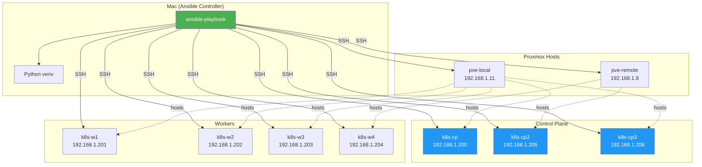
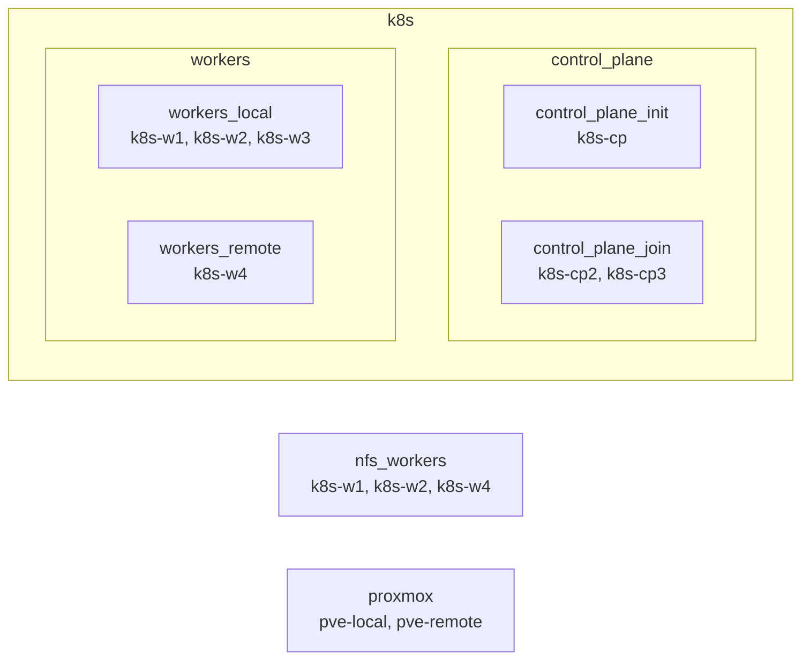

# Ansible Automation for Proxmox K8s Cluster

Ansible-based replacement for the shell scripts in `scripts/`. Manages VM provisioning on Proxmox, Kubernetes cluster bootstrapping, HA conversion, and addon installation — all from your Mac.

## Architecture



## Quick Start

```bash
# 1. Setup Python venv + Ansible
cd ansible/
bash setup.sh

# 2. Activate the virtual environment
source .venv/bin/activate

# 3. Verify connectivity
ansible all -m ping

# 4. Run the full cluster setup
ansible-playbook playbooks/site.yml

# Or run individual phases:
ansible-playbook playbooks/01-create-vms.yml
ansible-playbook playbooks/02-prepare-nodes.yml
ansible-playbook playbooks/03-init-cluster.yml
```

## Directory Structure

```
ansible/
├── ansible.cfg                  # Ansible configuration
├── setup.sh                     # venv + Ansible installer
├── requirements.yml             # Ansible Galaxy collections
├── inventory/
│   ├── hosts.yml                # All hosts & groups
│   └── group_vars/
│       ├── all.yml              # Shared variables
│       ├── control_plane.yml    # CP node defaults
│       ├── control_plane_join.yml
│       └── workers.yml          # Worker node defaults
├── roles/
│   ├── proxmox-vm/              # Create VM on Proxmox host
│   ├── k8s-common/              # Node prep (containerd, kubeadm)
│   ├── k8s-control-plane-init/  # kubeadm init
│   ├── k8s-control-plane-join/  # Join as CP node (HA)
│   ├── k8s-worker-join/         # Join as worker
│   ├── calico/                  # Calico CNI install
│   ├── kube-vip/                # kube-vip for HA VIP
│   ├── longhorn-deps/           # Longhorn prerequisites
│   ├── nfs-mounts/              # NFS mount setup
│   └── ...
└── playbooks/
    ├── site.yml                 # Full end-to-end setup
    ├── 01-create-vms.yml        # Provision VMs on Proxmox
    ├── 02-prepare-nodes.yml     # Install K8s prerequisites
    ├── 03-init-cluster.yml      # Init CP + join workers
    ├── 04-install-monitoring.yml # kube-prometheus-stack
    ├── 05-install-ingress.yml   # MetalLB + NGINX ingress
    ├── 06-add-remote-worker.yml # Add k8s-w4 on remote PVE
    ├── 07-convert-ha.yml        # HA with kube-vip + 2 more CPs
    ├── 08-install-longhorn-deps.yml
    ├── 09-setup-nfs-mounts.yml
    ├── 10-add-hosts.yml         # Mac /etc/hosts entries
    ├── remove-node.yml          # Drain + destroy a node
    └── teardown.yml             # Destroy all VMs
```

## Playbooks Reference

| Playbook | Description | Target Hosts |
|----------|-------------|-------------|
| `01-create-vms.yml` | Create VMs on Proxmox from cloud-init template | `control_plane_init`, `workers_local` |
| `02-prepare-nodes.yml` | Install containerd, kubeadm, kubelet, kubectl | `control_plane_init`, `workers_local` |
| `03-init-cluster.yml` | kubeadm init, Calico CNI, join workers, kubeconfig | CP + workers + localhost |
| `04-install-monitoring.yml` | kube-prometheus-stack via Helm | `localhost` |
| `05-install-ingress.yml` | MetalLB + NGINX Ingress via Helm | `localhost` |
| `06-add-remote-worker.yml` | Provision k8s-w4 on remote Proxmox, join cluster | `workers_remote` |
| `07-convert-ha.yml` | kube-vip, 2 new CPs, full HA conversion | All |
| `08-install-longhorn-deps.yml` | open-iscsi, nfs-common, jq, cryptsetup | `k8s` (all nodes) |
| `09-setup-nfs-mounts.yml` | NFS fstab entries + mount | `nfs_workers` |
| `10-add-hosts.yml` | Add `*.homelab.local` to Mac `/etc/hosts` | `localhost` |
| `remove-node.yml` | Drain, delete, destroy a specific node | `localhost` + PVE |
| `teardown.yml` | Destroy all initial VMs (DESTRUCTIVE) | `localhost` + PVE |

## Inventory Groups



## Targeting Specific Groups

```bash
# Only prepare control plane nodes
ansible-playbook playbooks/02-prepare-nodes.yml -l control_plane

# Only prepare workers
ansible-playbook playbooks/02-prepare-nodes.yml -l workers

# Only a specific node
ansible-playbook playbooks/02-prepare-nodes.yml -l k8s-w1

# Remove a node
ansible-playbook playbooks/remove-node.yml -e target_node=k8s-w3

# Teardown (requires confirmation)
ansible-playbook playbooks/teardown.yml
```

## Variables

Key variables are in `inventory/group_vars/all.yml`:

| Variable | Default | Description |
|----------|---------|-------------|
| `k8s_version` | `1.32` | Kubernetes version |
| `pod_cidr` | `10.244.0.0/16` | Pod network CIDR |
| `calico_version` | `v3.29.3` | Calico CNI version |
| `kube_vip_address` | `192.168.1.199` | HA virtual IP |
| `ingress_ip` | `192.168.1.240` | MetalLB ingress IP |
| `vm_template_id` | `9000` | Proxmox cloud-init template |
