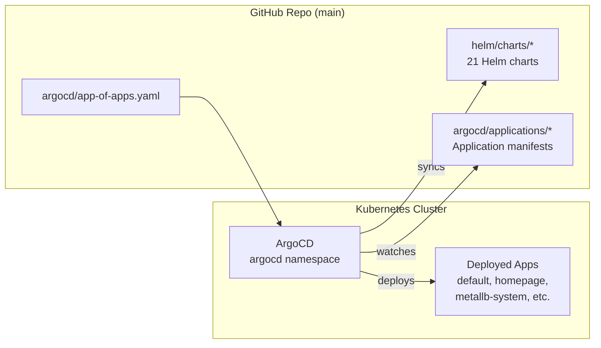

# ArgoCD GitOps Setup

ArgoCD manages all Helm chart deployments using this repo (`main` branch) as the single source of truth.

## Architecture



## How It Works

1. **App-of-Apps** — A root ArgoCD Application ([app-of-apps.yaml](app-of-apps.yaml)) watches the `argocd/applications/` directory
2. **Application Manifests** — Each chart has an Application CR in `argocd/applications/` pointing to its Helm chart path
3. **Auto-Sync** — All apps have `automated.prune` and `selfHeal` enabled — push to `main` and ArgoCD deploys

## Install

```bash
cd ansible
ansible-playbook playbooks/11-install-argocd.yml
```

This will:
- Install ArgoCD via Helm into the `argocd` namespace
- Apply the App-of-Apps manifest
- Print the admin password and UI URL

## Access

- **UI:** https://argocd.homelab.local
- **User:** `admin`
- **Password:** Retrieve with:
  ```bash
  kubectl get secret argocd-initial-admin-secret -n argocd -o jsonpath="{.data.password}" | base64 --decode
  ```

## Adding a New App

1. Create your Helm chart in `helm/charts/<app-name>/`
2. Create an Application manifest in `argocd/applications/<app-name>.yaml`:
   ```yaml
   apiVersion: argoproj.io/v1alpha1
   kind: Application
   metadata:
     name: <app-name>
     namespace: argocd
   spec:
     project: default
     source:
       repoURL: https://github.com/youruser/proxmox-k8s.git
       targetRevision: main
       path: helm/charts/<app-name>
     destination:
       server: https://kubernetes.default.svc
       namespace: default
     syncPolicy:
       automated:
         prune: true
         selfHeal: true
       syncOptions:
         - CreateNamespace=true
   ```
3. Push to `main` — ArgoCD picks it up automatically

## Charts with Secrets

`jellystat` and `vpn-downloader` reference `values-secret.yaml` in their Application specs. These files are in the repo (gitignored or encrypted as needed). For a more secure approach, consider [ArgoCD Vault Plugin](https://argocd-vault-plugin.readthedocs.io/) or [Sealed Secrets](https://sealed-secrets.netlify.app/).

## Namespace Mapping

| Application | Target Namespace |
|---|---|
| metallb-config | `metallb-system` |
| longhorn-ingress | `longhorn-system` |
| headlamp | `headlamp` |
| glances, homepage | `homepage` |
| All others (17 apps) | `default` |
